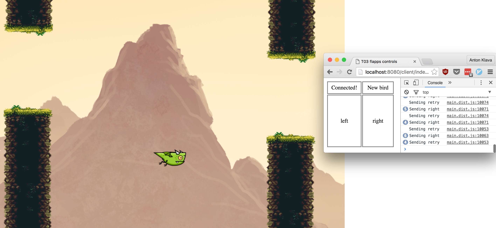

# T03-flappy

Basic multiplayer flappy bird game created during a 5 hour hackathon.
Created using [phaser](http://phaser.io/).



The websocket latency makes it kinda unplayable so I've decided not to take it
any further.

## Usage

You need a recent version of node and an updated browser.

```bash
npm install
make watch-server # Run these 3 in separate terminals
make watch-client
make server
```

Then open <http://localhost:8080/server/index.html> in one browser tab and
<http://localhost:8080/client/index.html> in another.
